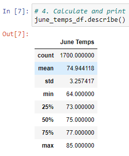
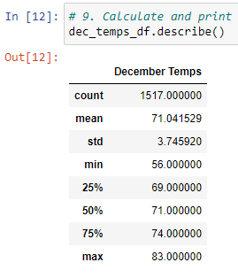
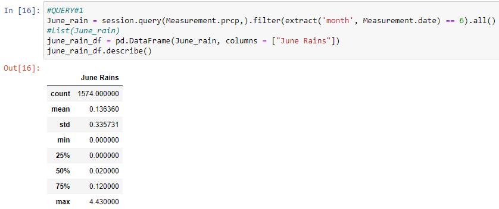
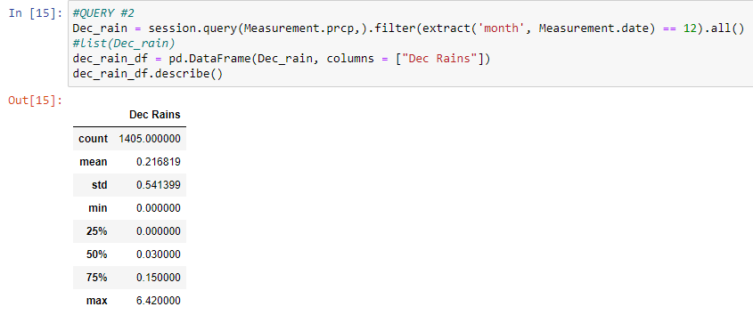

# surfs_up Challenge
Module 9 - Advanced Data Storage and Retrieval

## Purpose
W. Avy is looking to invest in my surf shop in Oahu, Hawaii selling surfboards and ice-cream. Before investing in the shop, he is concerned about the weather temperature trends and wants temperature data especifically for June and December in Oahu, to get a better idea if the shop business is sustainable year-round, and if this is a good business decision.

## Findings
After extracting June and December's temperatures, three differences that we can note ares:
* The minimum temperature in December is 56 degrees while the minimum temperature in June is 64 - 8 degrees less.
* The average temperature in December was about 71 degrees, while the average temperature in June is about 75 degrees.
* The temperatures for both month were closely cluttered ones, with standard deviations of 3.26 degrees in June and 3.75 degrees in December.

Below are the some summary statistics of June and December temperatures in Oahu respectively.

 

## Summary
Based on the data, I can conclude that Oahu, Hawaii is a great place to open shop for surfboards and ice-cream. Temperatures are mild and warm year round with averages above 70 degrees during both summer and winter months - both during holiday/vacation seasons, where there's an influx of tourists.

2 more queries that we can check is the precipitation or rain levels for both of these 2 months, because rain would affect the amount of tourists/people on the beach, let alone surfing those waves.

 
